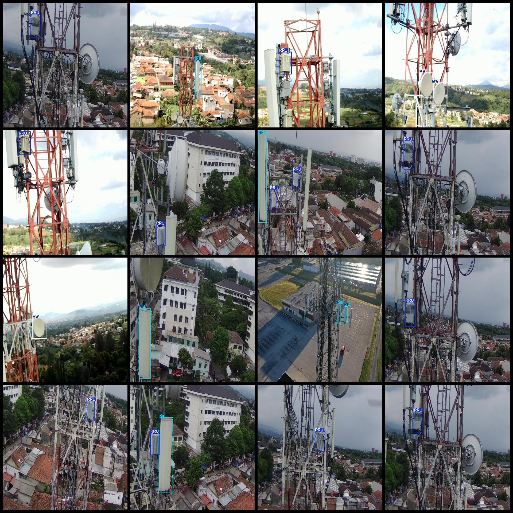

# Drone Signal Device Detection Dataset VOC+YOLO Format with 1877 Images in 3 Categories

Dataset Format: Pascal VOC format + YOLO format (text file without split paths, only containing JPG images along with corresponding VOC format XML files and YOLO format TXT files)
Number of Images: 1877
Number of Annotations: 1877
Number of Annotations: 1877
Number of Annotation Categories: 3
Repository: firc-dataset
Annotation Category Names (please note that the order of categories in the YOLO format is different from this, and should be based on the "labels" folder's "classes.txt" file): ["MW", "RF", "RRU"]
Number of Boxes per Category:
MW boxes = 572
RF boxes = 700
RRU boxes = 1146
Total Boxes: 2418
Image Resolution: 1280x1280
Annotation Tool Used: labelImg
Annotation Rules: Draw bounding boxes for the categories
Important Notice: No guarantees are made regarding the accuracy of the trained models or weight files.
Drone: DJI mini2
Total Memory Size: 389M (1877 images)
Image Resolution: 1280x1280
Collection Height: 30~60m
Collection Angle: 30~60°
Application Areas: Used for mobile signal base station, radio unit, and other wireless signal device detection, low altitude target detection, and more.
Image Preview:
Annotation Example:

## Images

Here is a pay link on Stripe ( https://buy.stripe.com/3cs8yP7sY87d0vu9AB ). Please contact me lonlonago@foxmail.com after funding $89, and I will send you a complete data files , thank you!

